# Stock Data Prediction Project
A comparative study of CNN, RNN and LSTM architectures for stock‐price forecasting using TensorFlow.

## Table of Contents

- [Project Overview](#project-overview)  
- [Features](#features)
- [Dependencies](#dependencies)  
- [Installation](#installation)  
- [Data Source](#data-source)
- [Modeling Pipeline](#modeling-pipeline)
- [Prediction Results](#prediction-results)
- [Evaluation Metrics](#evaluation-metrics)
- [License](#license)  

## Project Overview
This project benchmarks three deep‐learning approaches—1D Convolutional Neural Networks (CNNs), vanilla Recurrent Neural Networks (RNNs), Long Short-Term Memory networks (LSTMs) and Vector Auto Regression(VAR) — on historical stock‐price data. The goal is to identify which model achieves the best trade-off between forecasting accuracy and training/inference efficiency.

## Features
- Data ingestion & preprocessing pipeline  
- Parameterized TensorFlow training scripts for CNN, RNN and LSTM  
- Automated evaluation: MSE, MAE, RMSE, direction accuracy  
- Visualization of loss curves and predicted vs actual prices

## Dependencies
- NumPy - Numerical operations and array structures
- Pandas - Dataset management and preprocessing  
- Matplotlib - visualisations
- Seaborn - Matplotlib library, enhanced plotting styles
- scikit-learn - Data scaling and train-test splitting
- TensorFlow - Deep learning model implementation)  
- statsmodels - Vector AutoRegression (VAR) baseline model


## Installation
1. Clone this repo
   ```bash
   git clone https://github.com/TomWai821/StockDataPredictionProject.git
   cd StockDataPredictionProject

2. Create a virtual environment and install dependencies
   ```bash
   python3 -m venv venv source venv/bin/activate

   # on Windows:
   venv\Scripts\activate pip install -r requirements.txt

## Data Source
### Data Source
The experiments use daily OHLCV (Open, High, Low, Close, Volume) data for the NIFTY 50 index constituents, downloaded from Kaggle:
- Source: “Nifty50 Stock Market Data” by Rohan Rao  
- URL: https://www.kaggle.com/datasets/rohanrao/nifty50-stock-market-data  
- Files: one CSV per ticker (e.g. `ADANIPORTS.csv`)  
- Period: November 2007 – August 2021  
- Columns Include:
   - Date
   - Price indicators: Open, High, Low, Last, Close, VWAP 
   - Volume indicators: Volume, Turnover, Deliverable Volume, %Deliverable
 
- Column description<br>
  ****Stock Price Indicators:**** <br>
  | Column Name | Description                                                                                                       |
  | ----------- | ----------------------------------------------------------------------------------------------------------------- |
  | Open        | The first traded price of the stock when the market opens for the day                                             |
  | High        | The highest price reached during the trading session                                                              |
  | Low         | The lowest price traded throughout the session                                                                    |
  | Last        | The final price at which the stock was traded before market close                                                 |
  | Close       | Official end-of-day price, often used for technical analysis                                                      |
  | VWAP        | Volume Weighted Average Price – the average price adjusted for volume; reflects actualet value throughout the day |
  
  ****Stock Volume Indicators:**** <br>
  | Column Name        | Description                                                                 |
  | ------------------ | --------------------------------------------------------------------------- |
  | Volume             | Total number of shares traded over some time                                |
  | Turnover           | The total monetary value of shares traded (Volume × Price)                  |
  | Deliverable Volume | Portion of traded shares that are settled (not squared off intra-day)       |
  | %Deliverable       | Ratio of deliverable volume to total volume – indicates investor conviction |

<details>
<summary>Image for data filtering and description</summary>
   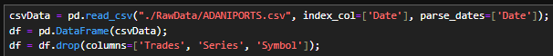<br>
   Image 1.1 - Filter out not useful data and set the CSV file data to a dataframe<br>
   
   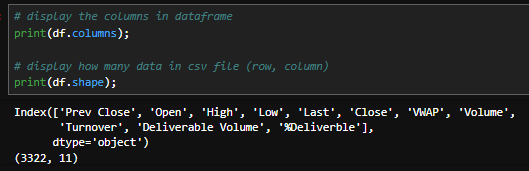<br>
   Image 1.2 - Column in dataframe and the shape of dataframe<br>
   
   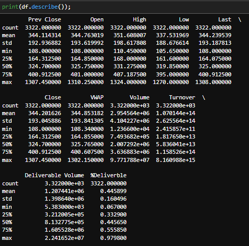<br>
   Image 1.3 - Data description for each column<br>
   
   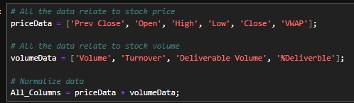<br>
   Image 1.4 - Group up the data to priceData and volumeData (used for the data analyst before data training)
</details>


### 2. Data Analyst
Analyse the data range, trends and the relation in each column
- Diagram Used:
   - Box Plot (View the range of data)
   - Time Series Map (View the trends of data)
   - Heatmap and pair plot (View the data relation)
  
#### Image for Data Analyst
<details>
   <summary>Box plot (Stock Price Data)</summary>
   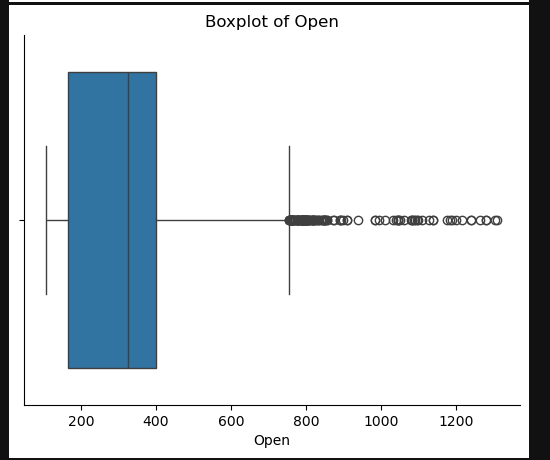<br>
   Image 2.1 - Box plot for Open column data<br>
   
   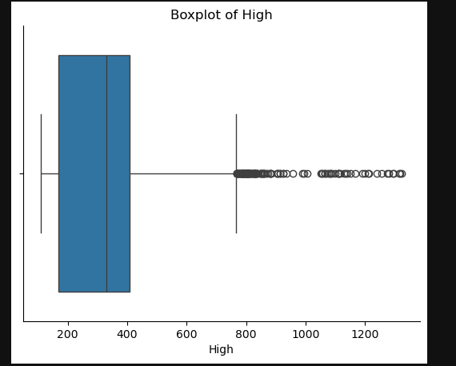<br>
   Image 2.2 - Box plot for High column data<br>
   
   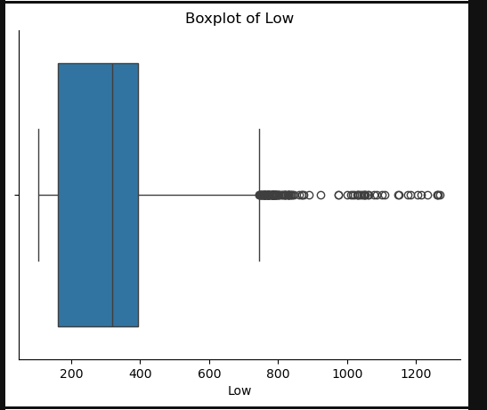<br>
   Image 2.3 - Box plot for Low column data<br>
   
   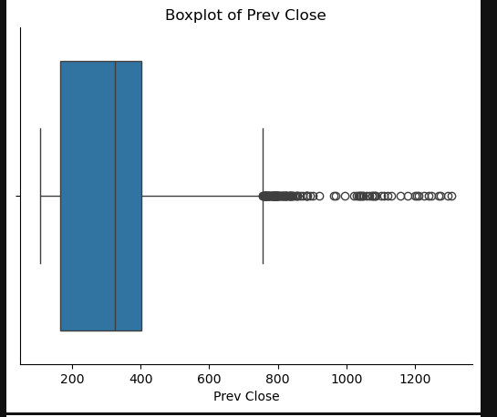<br>
   Image 2.4 - Box plot for Prev Close column data<br>
   
   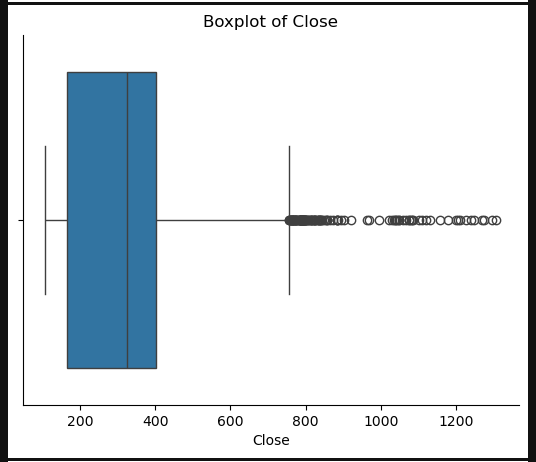<br>
   Image 2.5 - Box plot for Close column data<br>
   
   <br>
   Image 2.6 - Box plot for VWAP column data<br>
</details>


<details>
   <summary>Box plot (Stock Volume Data)</summary>
   <br>
   Image 2.7 - Box plot for Turnover column data<br>
   
   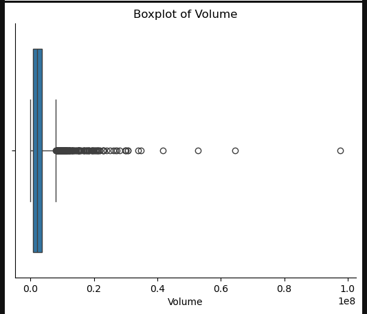<br>
   Image 2.8 - Box plot for Volume column data<br>
   
   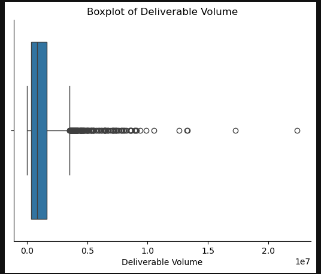<br>
   Image 2.9 - Box plot for DeliverableVolume column data<br>
   
   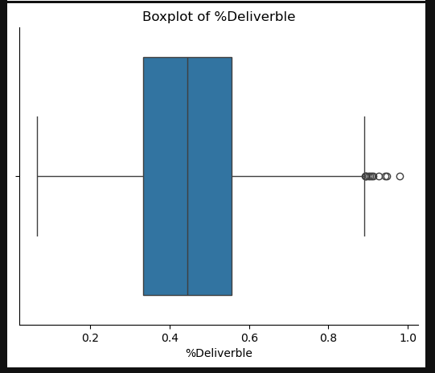<br>
   Image 2.10 - Box plot for %Deliverable column data<br>
</details>


<details>
   <summary>Time Series Chart (Stock Price Data)</summary>
   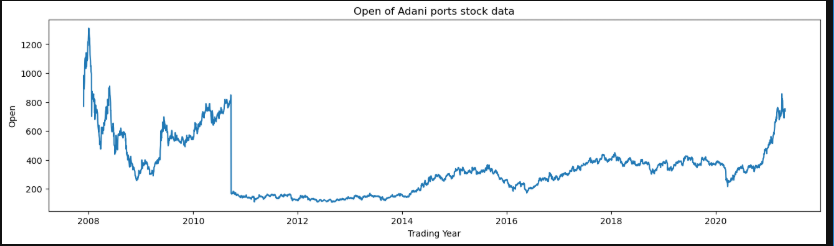<br>
   Image 2.11 - Time Series Chart for Open column data<br>
   
   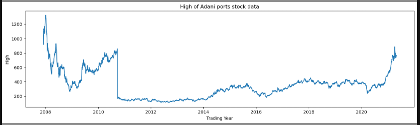<br>
   Image 2.12 - Time Series Chart for High column data<br>
   
   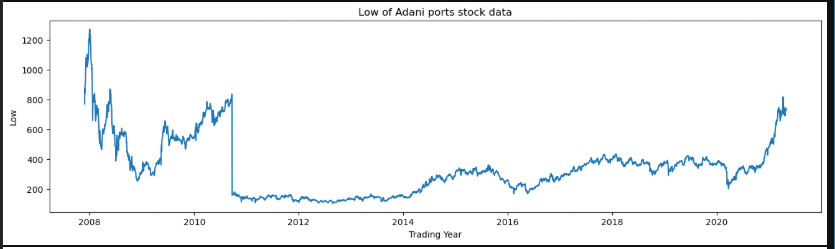<br>
   Image 2.13 - Time Series Chart for Low column data<br>
   
   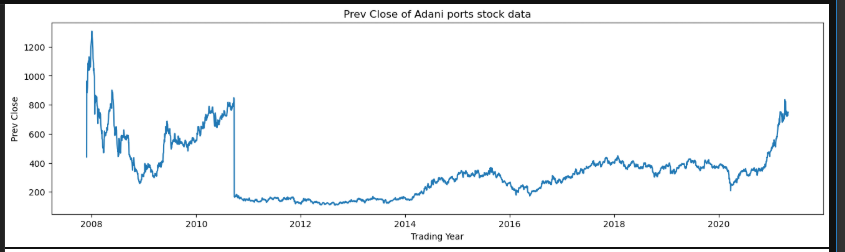<br>
   Image 2.14 - Time Series Chart for Prev Close column data<br>
   
   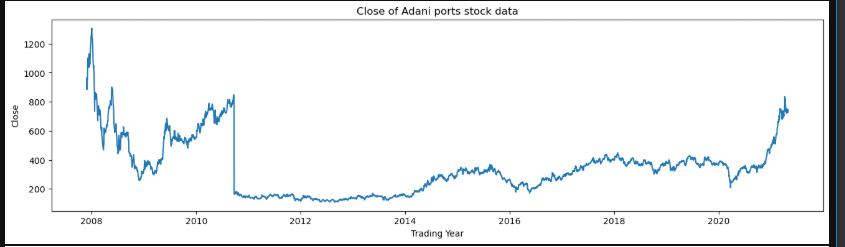<br>
   Image 2.15 - Time Series Chart for Close column data<br>
   
   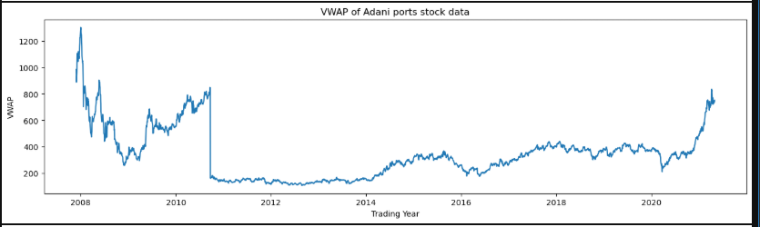<br>
   Image 2.16 - Time Series Chart for VWAP column data<br>
</details>


<details>
   <summary>Time Series Chart (Stock Volume Data)</summary>
   
   <br>
   Image 2.17 - Time Series Chart for Turnover column data<br>
   
   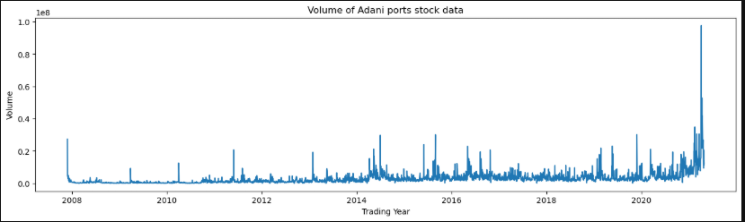<br>
   Image 2.18 - Time Series Chart for Volume column data<br>
   
   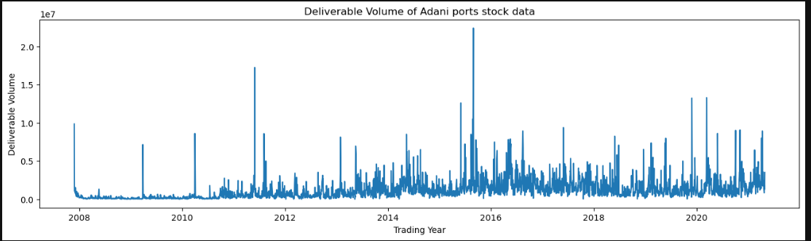<br>
   Image 2.19 - Time Series Chart for DeliverableVolume column data<br>
   
   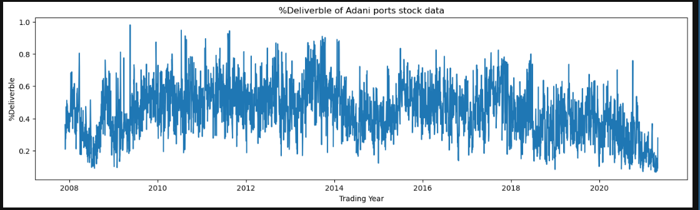<br>
   Image 2.20 - Time Series Chart for %Deliverable column data<br>
</details>


<details>
   <summary>Pair Plot</summary>
   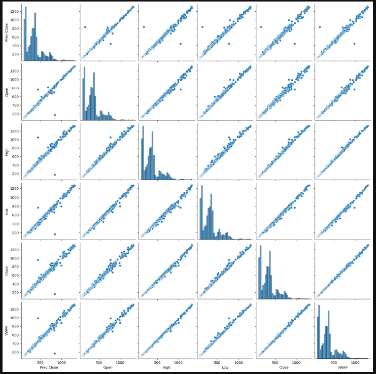<br>
   Image 2.21 - Pair Plot for Stock price related data<br>
   
   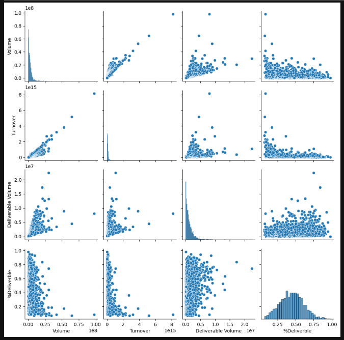<br>
   Image 2.22 - Pair Plot for Stock volume related data<br>
   
   **Description:**<br>
   ***Image 2.21:***
   - Pair plot shows consistent scatter patterns across variables, suggesting potential correlations
     
   ***Image 2.22***
   - Volume, Turnover, and Deliverable Volume are strongly correlated, reflecting trading activity
   - %Deliverable shows weaker associations, capturing a distinct settlement-related dimension
</details>


<details>
   <summary>HeatMap</summary>
   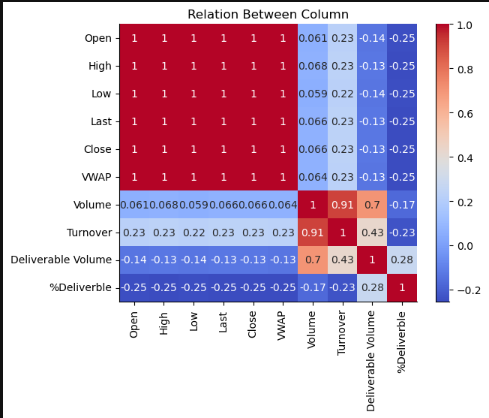<br>
   Image 2.23 - HeatMap for the whole data<br>
   
   **Description:**
   - Heatmap confirms strong correlations among stock price variables (Open, High, Low, Last, Close, VWAP)  
   - Volume and Turnover are highly correlated (0.91), showing trading volume drives transaction value  
   - Deliverable Volume shows moderate links to Volume (0.43) and Turnover (0.28)  
   - %Deliverable has weak correlations, reflecting a distinct settlement-related dimension
</details>


## Modeling Pipeline
### 1. Preprocessing
1. Scale each column to [0,1] with MinMaxScaler
2. Window into 60-day input sequences for supervised learning
3. Split 80% train / 20% test<br>


<details>
   <summary>Image for Preprocessing</summary>
   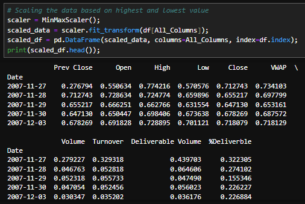<br>
   Image 1.1 - Apply MinMaxScaler<br>
   
   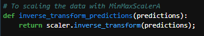<br>
   Image 1.2 - Function to apply MinMaxScaler<br>
   
   <br>
   Image 1.3 - Data Labeling and split to 80% data for training<br>
   
   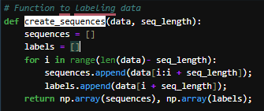<br>
   Image 1.4 - Function For creating sequences<br>
   
   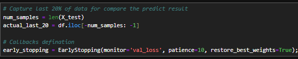<br>
   Image 1.5 - Split the Last 20% of the data for the test 
</details>


### 2. Models Applications
- **CNN**: 1D conv layers + global pooling  
- **RNN**: SimpleRNN layers
- **LSTM**: Stacked LSTM cells with dropout
- **VAR**: Vector AutoRegression model

**Remarks:**
- VAR is a classical statistical approach that uses multiple lagged variables to capture linear interdependencies among time series


<details> 
   <summary>Image for apply Deep Learning Models</summary>
   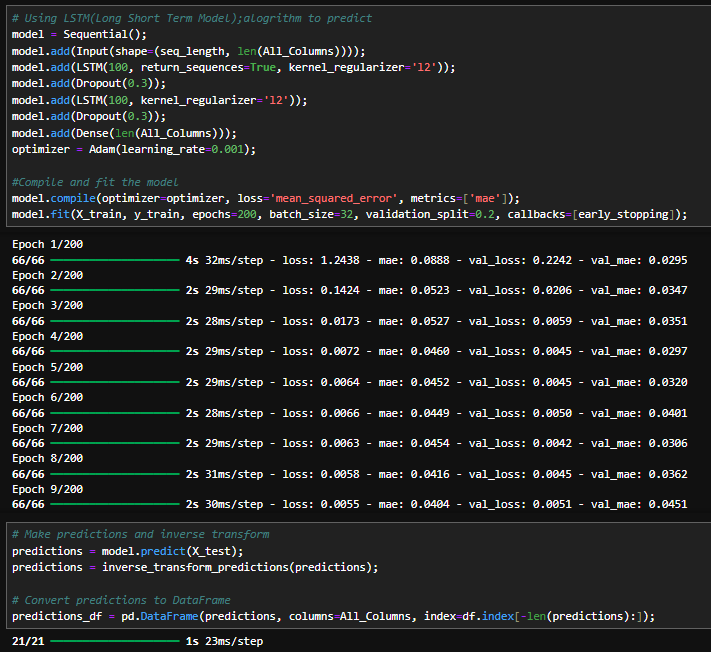<br>
   Image 2.1 - Source Code about LSTM Application
   
   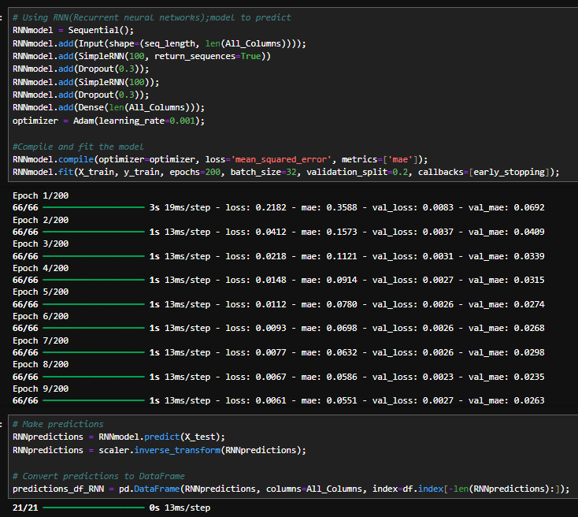<br>
   Image 2.2 - Source Code about RNN Application
   
   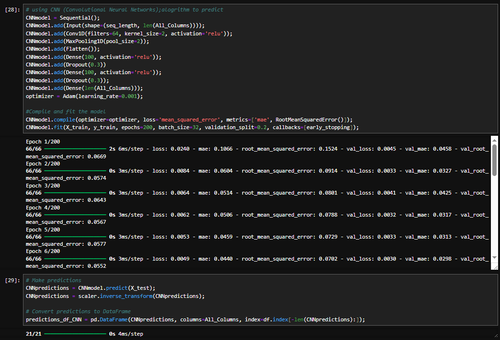<br>
   Image 2.3 - Source Code about CNN Application<br>
   
   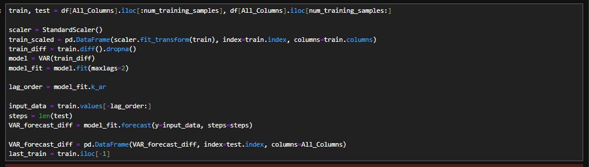<br>
   Image 2.4 - Source Code about VAR Application<br>
   
   ****Description:****
   - Historical stock data was scaled and segmented into 60-day rolling sequences
   - Each deep learning model (CNN, RNN, LSTM) was trained on identical input formats to ensure consistency
   - TensorFlow implementations were used:
      - 1D convolutional layers for CNN to detect short-term price patterns
      - Simple RNN cells to capture sequential dependencies
      - Stacked LSTM units to learn long-term temporal features in stock movements
        
   - VAR (Vector AutoRegression) was implemented as a statistical baseline
      - Applied differencing and scaling to model linear interdependencies
      - Forecasts based on lagged inputs were compared against actual stock prices
        
   **Conclusion:**
   - This setup provides a fair comparison between classical statistical methods and deep learning approaches for financial forecasting
</details>


## Prediction Results
### 1. Prediction Results For LSTM
<details>
   <summary>Result of stock data prediction (LSTM) - Stock Price Data</summary>
   <br>
   Image 1.1 - LSTM Data prediction Result - Open
   
   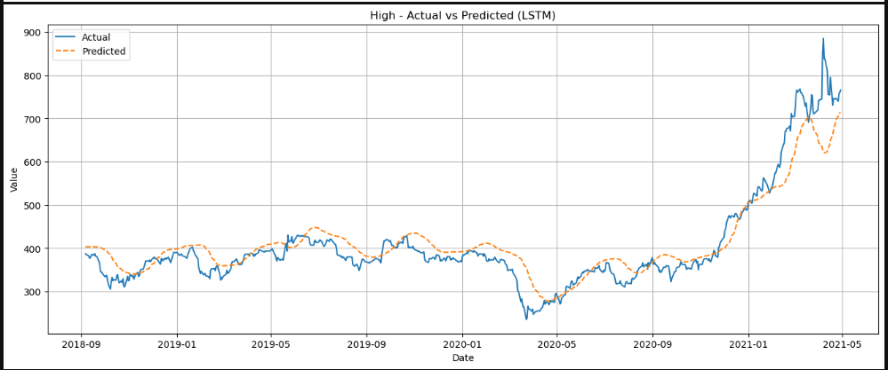<br>
   Image 1.2 - LSTM Data prediction Result - High
   
   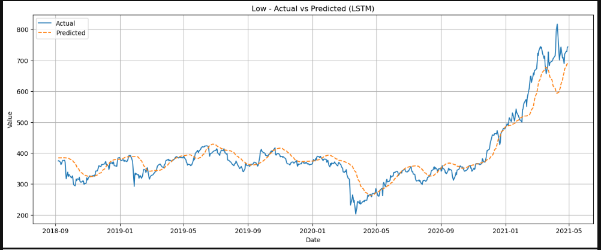<br>
   Image 1.3 - LSTM Data prediction Result - Low
   
   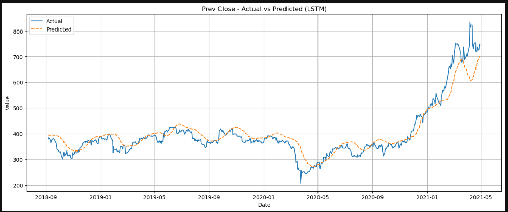<br>
   Image 1.4 - LSTM Data prediction Result - Prev Close
   
   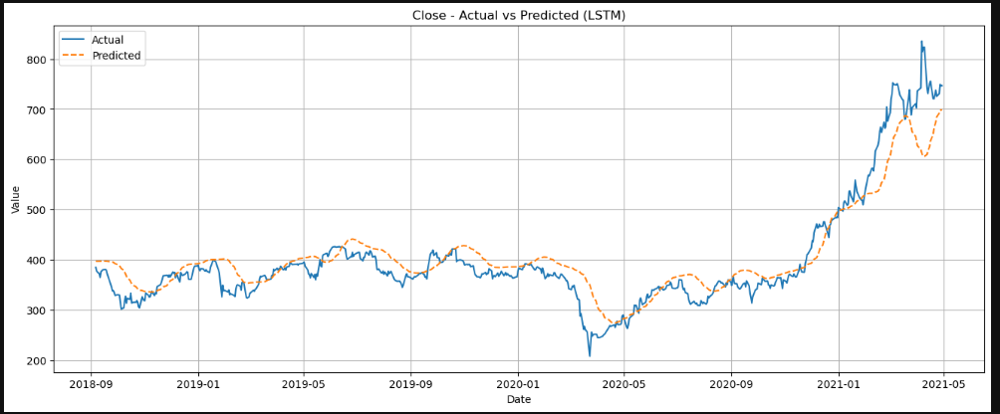<br>
   Image 1.5 - LSTM Data prediction Result - Close
   
   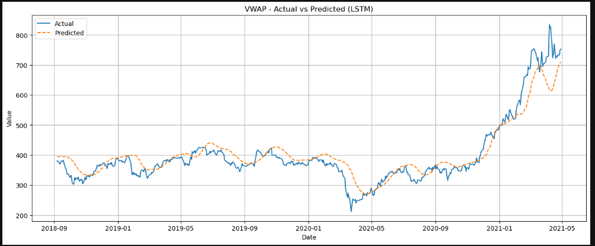<br>
   Image 1.6 - LSTM Data prediction Result - VWAP
   
   ****Description:****
   - LSTM predictions mirror the overall trend, rising and falling with actual prices  
   - Divergence appears in timing and amplitude, missing sharp peaks or sudden drops  
   - Limitations stem from memory constraints and lack of external signals for abrupt market shifts
</details>

   
<details>
   <summary>Result of stock data prediction (LSTM) - Stock Volume Data</summary>
   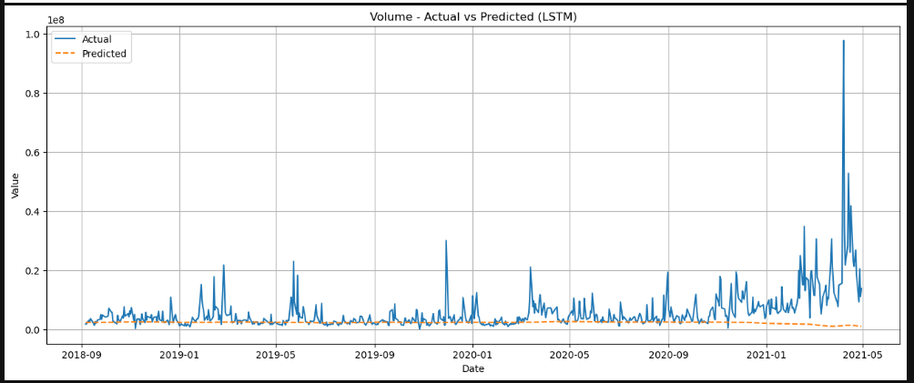<br>
   Image 1.7 - LSTM Data prediction Result - Volume
   
   <br>
   Image 1.8 - LSTM Data prediction Result - Turnover
   
   <br>
   Image 1.9 - LSTM Data prediction Result - Deliverable Volume
   
   <br>
   Image 1.10 - LSTM Data prediction Result - %Deliverable
   
   ****Description:**** <br>
   - LSTM captures the baseline of volume-related data  
   - Underreacts to sudden surges or dips, producing muted predictions during high activity  
   - Limited by reliance on historical OHLCV data, lacking external catalysts like news or macro signals
</details>


### 2. Prediction Results For RNN
<details>
   <summary>Result of stock data prediction (RNN) - Stock Price Data</summary>
   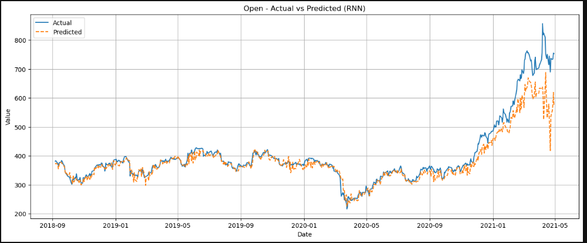<br>
   Image 2.1 - RNN Data prediction Result - Open
   
   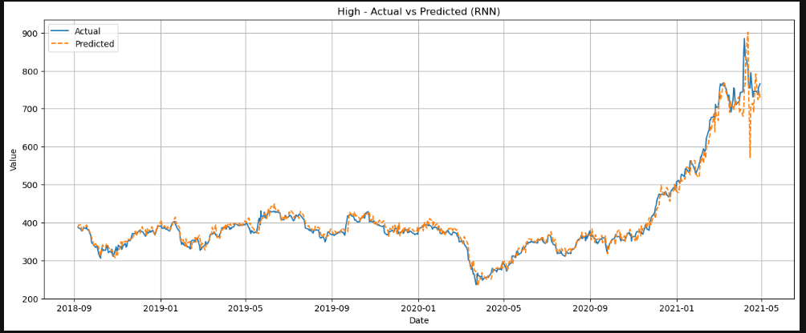<br>
   Image 2.2 - RNN Data prediction Result - High
   
   <br>
   Image 2.3 - RNN Data prediction Result - Low
   
   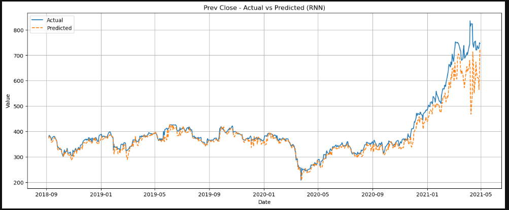<br>
   Image 2.4 - RNN Data prediction Result - Prev Close
   
   <br>
   Image 2.5 - RNN Data prediction Result - Close
   
   <br>
   Image 2.6 - RNN Data prediction Result - VWAP
   
   ****Description:****
   - Model captures overall directional trends during gradual movements  
   - Misses sharp spikes or dips, reflecting reliance on historical values without external signals
</details>


<details>
   <summary>Result of stock data prediction (RNN) - Stock Volume Data</summary>
   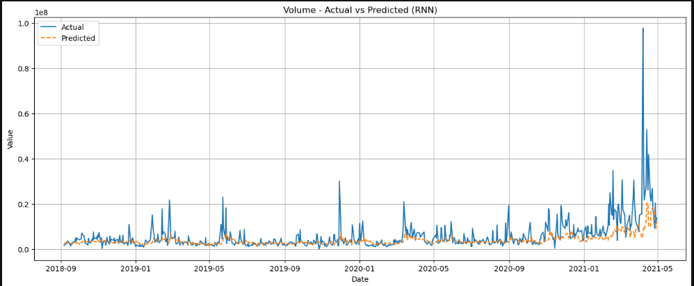<br>
   Image 2.7 - RNN Data prediction Result - Volume
   
   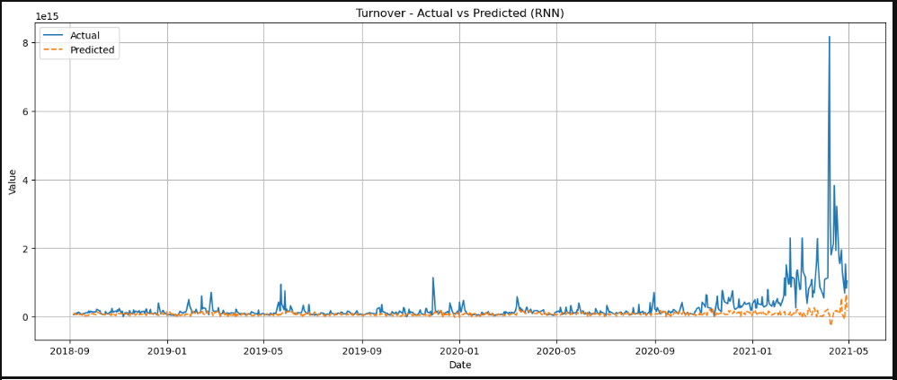<br>
   Image 2.8 - RNN Data prediction Result - Turnover
   
   <br>
   Image 2.9 - RNN Data prediction Result - Deliverable Volume
   
   <br>
   Image 2.10 - RNN Data prediction Result - %Deliverable
   
   ****Description:**** <br>
   For others:
   - Captures broad turnover and %Deliverable trends, staying close to average movement  
   - Underreacts to sharp fluctuations, missing spikes or sudden drops 
   
   For %Deliverable Data:
   - Limited in handling high-volatility features, as it doesn’t integrate sudden market catalysts
</details>


### 3. Prediction Results For CNN
<details>
   <summary>Result of stock data prediction (CNN) - Stock Price Data</summary>
   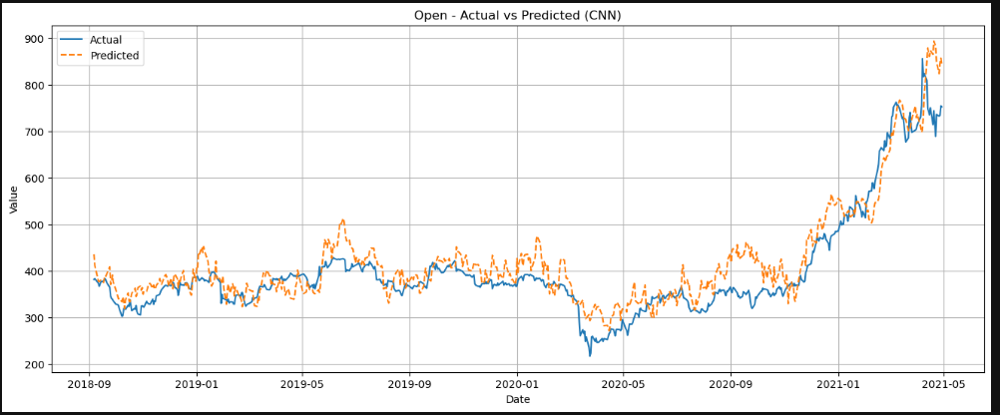<br>
   Image 3.1 - CNN Data prediction Result - Open
   
   <br>
   Image 3.2 - CNN Data prediction Result - High
   
   <br>
   Image 3.3 - RNN Data prediction Result - Low
   
   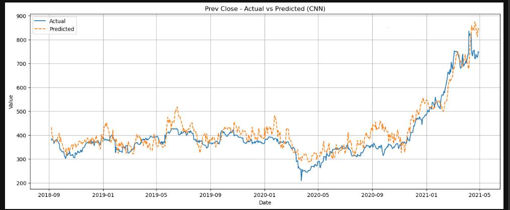<br>
   Image 3.4 - CNN Data prediction Result - Prev Close
   
   <br>
   Image 3.5 - CNN Data prediction Result - Close
   
   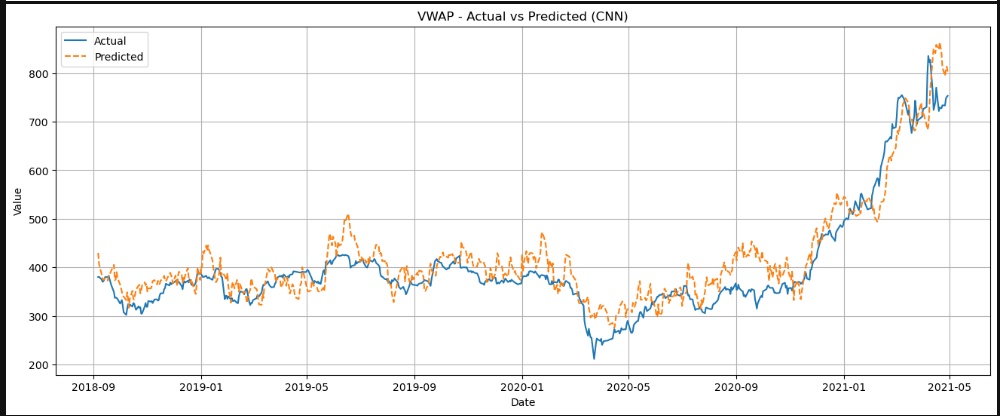<br>
   Image 3.6 - CNN Data prediction Result - VWAP
   
   ****Description:****
   - CNN tracks overall price trends during steady climbs and dips  
   - Lags behind sharp market movements, missing full amplitude  
   - Strong at local pattern recognition but limited in long-term temporal modeling for volatile series
</details>


<details>
   <summary>Result of stock data prediction (CNN) - Stock Volume Data</summary>
   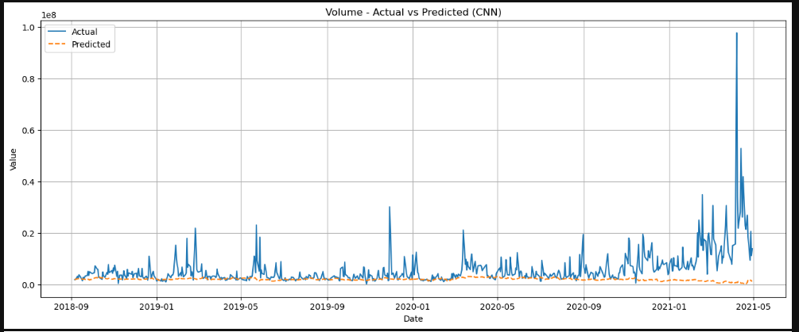<br>
   Image 3.7 - CNN Data prediction Result - Volume
   
   <br>
   Image 3.8 - CNN Data prediction Result - Turnover
   
   <br>
   Image 3.9 - CNN Data prediction Result - Deliverable Volume
   
   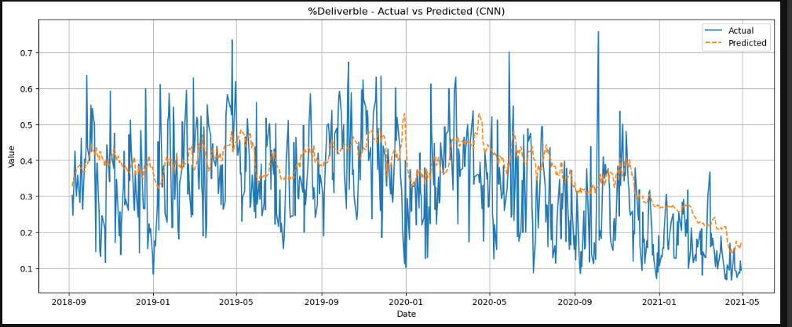<br>
   Image 3.10 - CNN Data prediction Result - %Deliverable
   
   ****Description:****
   For others:
   - CNN predictions remain mostly flat, underestimating turnover dynamics  
   - Actual data shows sharp spikes (e.g., early 2021) that CNN fails to capture  
   - Also highlights CNN’s limitation in modeling large-scale fluctuations due to weak temporal/context awareness
   
  For %Deliverable:
   - CNN captures the baseline trend during stable periods
   - Underperforms in volatile phases, missing sharp spikes or drops  
   - Limited in handling noisy, high-frequency variation due to weak temporal/context awareness
</details>


### 4. Prediction Results For VAR
<details>
   <summary>Result of stock data prediction (VAR) - Stock Price Data</summary>
   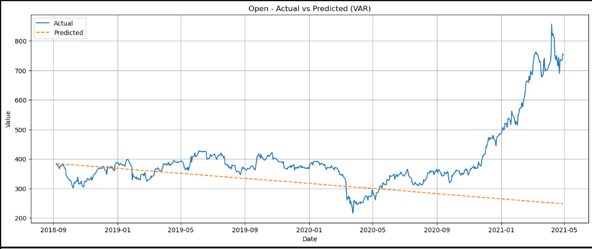<br>
   Image 4.1 - VAR Data prediction Result - Open
   
   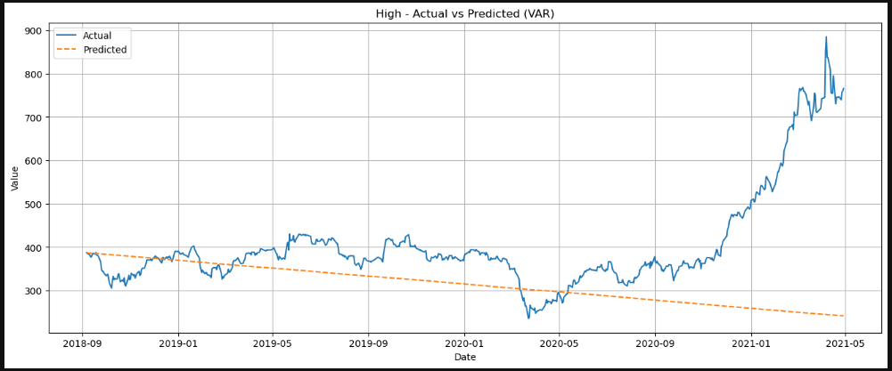<br>
   Image 4.2 - VAR Data prediction Result - High
   
   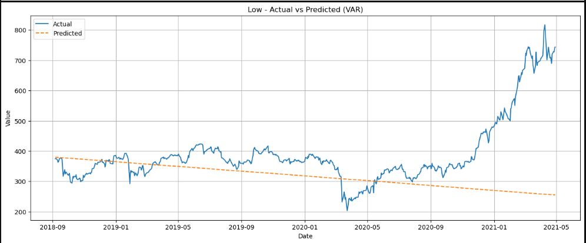<br>
   Image 4.3 - VAR Data prediction Result - Low
   
   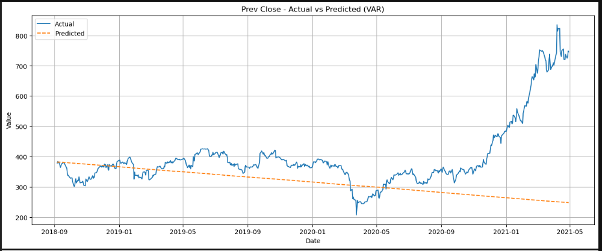<br>
   Image 4.4 - VAR Data prediction Result - Prev Close
   
   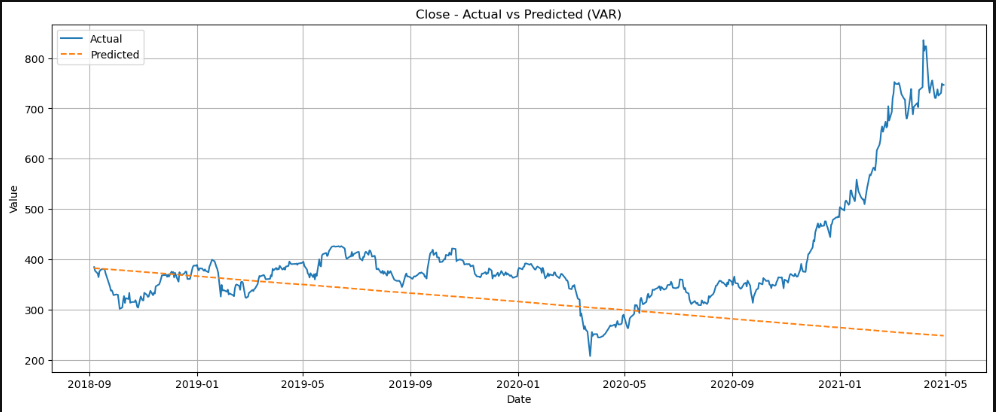<br>
   Image 4.5 - VAR Data prediction Result - Close
   
   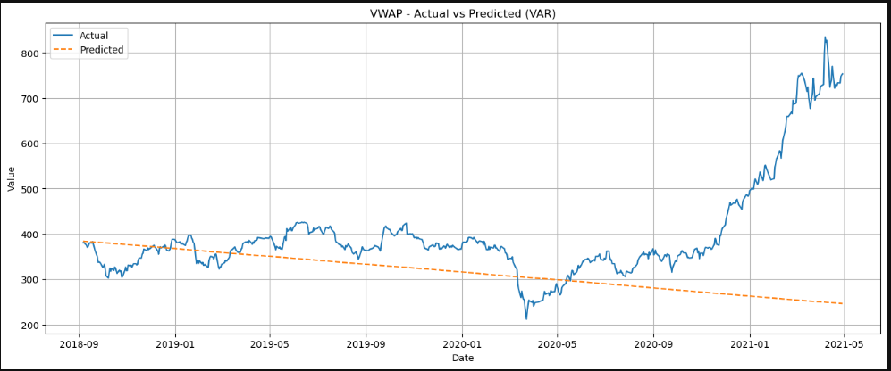<br>
   Image 4.6 - VAR Data prediction Result - VWAP
   
   ****Description:****
   - VAR-predicted values consistently fail to track the upward trend in actual stock prices  
   - This visual discrepancy reveals the limitations of linear models in capturing dynamic market behavior  
   - It reinforces the need for deep learning approaches that can model non-linear patterns and temporal dependencies
</details>


<details>
   <summary>Result of stock data prediction (VAR) - Stock Volume Data</summary>
   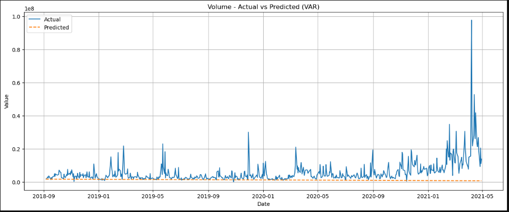<br>
   Image 4.7 - VAR Data prediction Result - Volume
   
   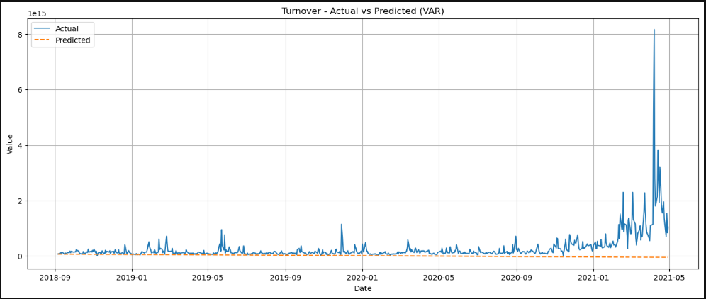<br>
   Image 4.8 - VAR Data prediction Result - Turnover
   
   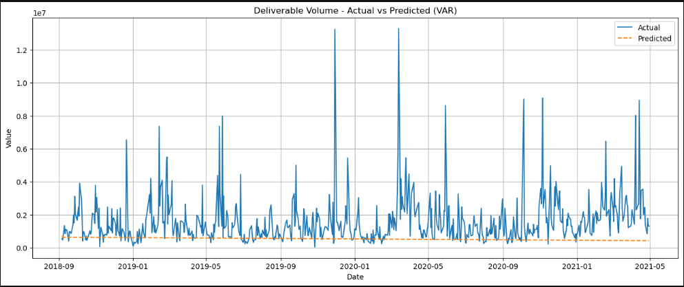<br>
   Image 4.9 - VAR Data prediction Result - Deliverable Volume
   
   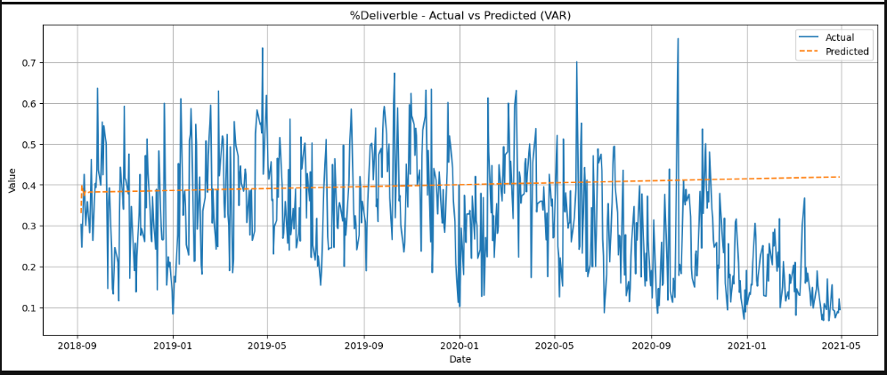<br>
   Image 4.10 - VAR Data prediction Result - %Deliverable
   
   ****Description:****
   For others:
   - VAR predictions remain flat across volume-related metrics, failing to reflect real-world volatility  
   - Underscores the limitations of linear statistical models in capturing dynamic market behavior  

   For %Deliverable:
   - Actual %Deliverable values show noticeable volatility, while VAR predictions remain smooth and muted  
   - Suggests VAR struggles to capture settlement-related fluctuations due to limited sensitivity to short-term catalysts  
   - Highlights the model’s inability to reflect dynamic shifts in delivery behavior driven by market conditions
</details>


## Evaluation Metrics
Forecast accuracy was assessed using MAE (average error) and RMSE (penalises large deviations)<br>
Together they form a balanced evaluation framework widely used in financial forecasting

### 1. Model Evaluation & Error Calculation Code
<details>
   <summary>Source Code for Data Comparison</summary>
   <br>
   Image 1.1 - Functions for calculating and displaying error scores

   ****Description:****<br>
   To identify the most accurate prediction model across multiple architectures (e.g. CNN, RNN, LSTM), the following steps are used:
   
   1. Data Preparation<br>
   - For each target column (e.g. volume, close price), extract the ground truth series from the “Actual” dataset  
   - In code: `actual_series = dataMap["Actual"][column]`
   
   2. Iterative Model Evaluation<br>
   - Loop through each model's prediction dataset  
   - Skip the "Actual" entry to avoid self-comparison  
   - Align the predicted series with the actual one using inner joins to ensure proper index matching  
   - In code: `predict_series.align(actual_series, join='inner')`
   
   3. Error Calculation<br>
   - Compute Mean Absolute Error (MAE) or Root Mean Squared Error (RMSE) between aligned series  
   - Store each model’s score for the current column  
   - In code: `mean_absolute_error(...)` or `np.sqrt(mean_squared_error(...))`
   
   4. Best Model Selection<br>
   - Choose the model with the lowest MAE score—this indicates the most accurate predictions for that column  
   - In code: `highlight_min(axis=0, color="green")` visually marks the best model
   
   5. Visualisation<br>
   - Plot time series data for the actual values and each model’s predictions  
   - Highlight the best-performing model for visual comparison  
   - In code: `display_min_score(...)` returns a styled DataFrame for easy inspection
</details>


### 2. Image for Data Comparison
<details>
   <summary>Data Comparison (Deep Learning models)</summary>
   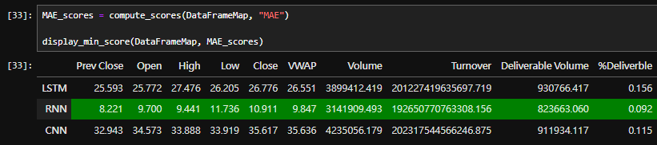<br>
   Image 2.1 - Deep Learning Model Comparing (MAE)
         
   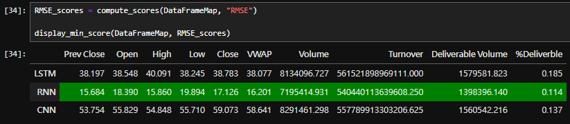<br>
   Image 2.2 - Deep Learning Model Comparing (RMSE)
         
   ****Description:****<br>
   - The RNN model consistently delivers the most accurate forecasts across all financial metrics
   - RNN outperforming LSTM and CNN in every category
</details>


<details>
   <summary>Data Comparison (RNN vs VAR)</summary>
   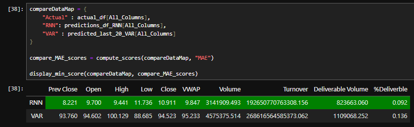<br>
   Image 2.3 - RNN vs VAR (MAE)
         
   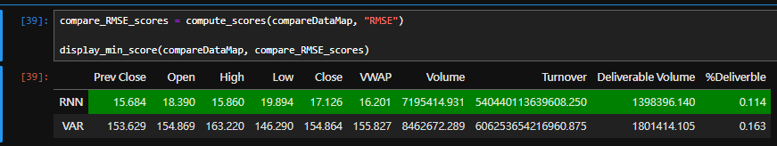<br>
   Image 2.4 - RNN vs VAR (RMSE)
         
   ****Description:****<br>
   - RNN consistently delivers lower error scores
   - VAR shows much higher prediction errors (especially in price-related metrics like Close, High, and VWAP)
   - This confirms RNN’s superior ability to capture market dynamics compared to traditional linear models like VAR
</details>


<details>
   <summary>Conclusion</summary>
      
   - RNN is the most suitable model for financial time series forecasting  
   - It captures dynamic market changes, learns temporal dependencies, and models complex non-linear relationships  

   - Consistently outperforms VAR, LSTM, and CNN in both MAE and RMSE evaluations  
      - VAR vs RNN  
         - VAR relies on linear assumptions and struggles with volatility  
         - RNN adapts better to non-stationary financial data  

      - LSTM vs RNN  
        - LSTM captures long-term dependencies but is more complex  
        - RNN achieves similar sequence modelling with lower complexity, making it more efficient for this dataset  

      - CNN vs RNN  
        - CNN focuses on local patterns  
        - RNN better handles long-term dependencies across multiple financial metrics  

   - Overall, RNN demonstrates the strongest balance of accuracy, stability, and adaptability across all tested models  
   - Highlights RNN as the most reliable choice for financial forecasting tasks (time-series based)  
</details>


## License
MIT License

Copyright (c) 2025 TomWai821

Permission is hereby granted, free of charge, to any person obtaining a copy
of this software and associated documentation files (the "Software"), to deal
in the Software without restriction, including without limitation the rights
to use, copy, modify, merge, publish, distribute, sublicense, and/or sell
copies of the Software, and to permit persons to whom the Software is
furnished to do so, subject to the following conditions:

The above copyright notice and this permission notice shall be included in all
copies or substantial portions of the Software.

THE SOFTWARE IS PROVIDED "AS IS", WITHOUT WARRANTY OF ANY KIND, EXPRESS OR
IMPLIED, INCLUDING BUT NOT LIMITED TO THE WARRANTIES OF MERCHANTABILITY,
FITNESS FOR A PARTICULAR PURPOSE AND NONINFRINGEMENT. IN NO EVENT SHALL THE
AUTHORS OR COPYRIGHT HOLDERS BE LIABLE FOR ANY CLAIM, DAMAGES OR OTHER
LIABILITY, WHETHER IN AN ACTION OF CONTRACT, TORT OR OTHERWISE, ARISING FROM,
OUT OF OR IN CONNECTION WITH THE SOFTWARE OR THE USE OR OTHER DEALINGS IN THE
SOFTWARE.
