# Stock Data Prediction Project
A comparative study of CNN, RNN and LSTM architectures for stock‐price forecasting using TensorFlow.

## Table of Contents

- [Project Overview](#project-overview)  
- [Features](#features)
- [Dependencies](#dependencies)  
- [Installation](#installation)  
- [Data Source](#dataSource)
- [Modeling Pipeline](#modelingpipeline)
- [Prediction Results](#predictionresults)
- [License](#license)  

## Project Overview
This project benchmarks three deep‐learning approaches—1D Convolutional Neural Networks (CNNs), vanilla Recurrent Neural Networks (RNNs) and Long Short-Term Memory networks (LSTMs)—on historical stock‐price data. The goal is to identify which model achieves the best trade-off between forecasting accuracy and training/inference efficiency.

## Features
- Data ingestion & preprocessing pipeline  
- Parameterized TensorFlow training scripts for CNN, RNN and LSTM  
- Automated evaluation: MSE, MAE, RMSE, direction accuracy  
- Visualization of loss curves and predicted vs actual prices

## Dependencies
- TensorFlow (Builds and trains deep learning models)
- NumPy (Handles numerical operations and array structures)
- Pandas (Manages datasets, DataFrames, and preprocessing)
- Matplotlib (Generates visualizations)
- Seaborn (Matplotlib library, it adds styling and context-aware enhancements to plots)
- scikit-learn (Supports data scaling and train-test splitting)

## Installation
1. Clone this repo
   ```bash
   git clone https://github.com/TomWai821/StockDataPredictionProject.git
   cd StockDataPredictionProject

2. Create a virtual environment and install dependencies
   ```bash
   python3 -m venv venv source venv/bin/activate

   # on Windows:
   venv\Scripts\activate pip install -r requirements.txt

## Data Source
### Data Source
The experiments use daily OHLCV (Open, High, Low, Close, Volume) data for the NIFTY 50 index constituents, downloaded from Kaggle:
- Source: “Nifty50 Stock Market Data” by Rohan Rao  
- URL: https://www.kaggle.com/datasets/rohanrao/nifty50-stock-market-data  
- Files: one CSV per ticker (e.g. `ADANIPORTS.csv`)  
- Period: November 2007 – August 2021  
- Columns Include:
   - Date
   - Price indicators: Open, High, Low, Last, Close, VWAP 
   - Volume indicators: Volume, Turnover, Deliverable Volume, %Deliverable
 
- Column description<br>
  ****Stock Price Indicators:**** <br>
  | Column Name | Description                                                                                                       |
  | ----------- | ----------------------------------------------------------------------------------------------------------------- |
  | Open        | The first traded price of the stock when the market opens for the day                                             |
  | High        | The highest price reached during the trading session                                                              |
  | Low         | The lowest price traded throughout the session                                                                    |
  | Last        | The final price at which the stock was traded before market close                                                 |
  | Close       | Official end-of-day price, often used for technical analysis                                                      |
  | VWAP        | Volume Weighted Average Price – the average price adjusted for volume; reflects actualet value throughout the day |
  
  ****Stock Volume Indicators:**** <br>
  | Column Name        | Description                                                                 |
  | ------------------ | --------------------------------------------------------------------------- |
  | Volume             | Total number of shares traded over some time                                |
  | Turnover           | The total monetary value of shares traded (Volume × Price)                  |
  | Deliverable Volume | Portion of traded shares that are settled (not squared off intra-day)       |
  | %Deliverable       | Ratio of deliverable volume to total volume – indicates investor conviction |

<details>
<summary>Image for data filtering and description</summary>
   <br>
   Image 1.1 - Filter out not useful data and set the CSV file data to a dataframe<br>
   
   <br>
   Image 1.2 - Column in dataframe and the shape of dataframe<br>
   
   <br>
   Image 1.3 - Data description for each column<br>
   
   <br>
   Image 1.4 - Group up the data to priceData and volumeData (used for the data analyst before data training)
</details>

### 2. Data Analyst
Analyse the data range, trends and the relation in each column
- Diagram Used:
   - Box Plot (View the range of data)
   - Time Series Map (View the trends of data)
   - Heatmap and pair plot (View the data relation)

  
#### Image for Data Analyst
<details>
   <summary>Box plot (Stock Price Data)</summary>
   <br>
   Image 2.1 - Box plot for Open column data<br>
   
   <br>
   Image 2.2 - Box plot for High column data<br>
   
   <br>
   Image 2.3 - Box plot for Low column data<br>
   
   <br>
   Image 2.4 - Box plot for Prev Close column data<br>
   
   <br>
   Image 2.5 - Box plot for Close column data<br>
   
   <br>
   Image 2.6 - Box plot for VWAP column data<br>
</details>

<details>
   <summary>Box plot (Stock Volume Data)</summary>
   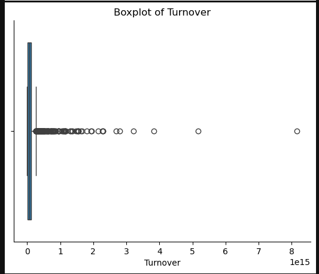<br>
   Image 2.7 - Box plot for Turnover column data<br>
   
   <br>
   Image 2.8 - Box plot for Volume column data<br>
   
   <br>
   Image 2.9 - Box plot for DeliverableVolume column data<br>
   
   <br>
   Image 2.10 - Box plot for %Deliverable column data<br>
</details>

<details>
   <summary>Time Series Chart (Stock Price Data)</summary>
   <br>
   Image 2.11 - Time Series Chart for Open column data<br>
   
   <br>
   Image 2.12 - Time Series Chart for High column data<br>
   
   <br>
   Image 2.13 - Time Series Chart for Low column data<br>
   
   <br>
   Image 2.14 - Time Series Chart for Prev Close column data<br>
   
   <br>
   Image 2.15 - Time Series Chart for Close column data<br>
   
   <br>
   Image 2.16 - Time Series Chart for VWAP column data<br>
</details>

<details>
   <summary>Time Series Chart (Stock Volume Data)</summary>
   
   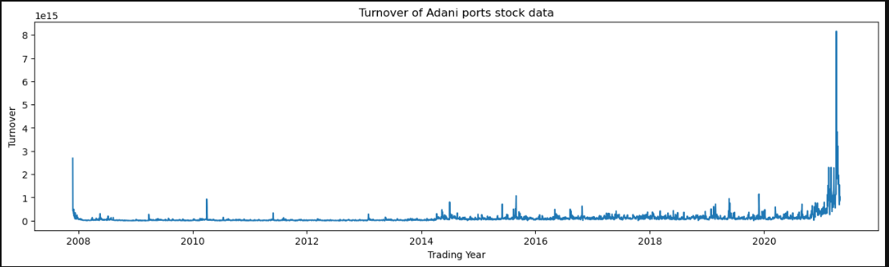<br>
   Image 2.17 - Time Series Chart for Turnover column data<br>
   
   <br>
   Image 2.18 - Time Series Chart for Volume column data<br>
   
   <br>
   Image 2.19 - Time Series Chart for DeliverableVolume column data<br>
   
   <br>
   Image 2.20 - Time Series Chart for %Deliverable column data<br>
</details>


<details>
   <summary>Pair Plot</summary>
   <br>
   Image 2.21 - Pair Plot for Stock price related data<br>
   
   <br>
   Image 2.22 - Pair Plot for Stock volume related data<br>
   
   **Description:**<br>
   ***Image 2.21:***
   - The pair plot reveals that many variable combinations produce scatter plots with similar shapes and distribution patterns. This visual consistency suggests potential inter-variable relationships, indicating that these features may be correlated or share underlying dependencies
     
   ***Image 2.22***
   - This pair plot highlights that Volume, Turnover, and Deliverable Volume exhibit comparable distribution shapes and scatter patterns, implying a strong positive correlation (Since these features all reflect different aspects of market trading activity, their relational nature is expected)
   - %Deliverable — representing the percentage of traded shares settled and delivered to buyers — shows inconsistent or weaker associations with the other variables
   - This suggests it captures a distinct dimension of market behaviour, more closely related to settlement mechanisms than trading intensity
</details>

<details>
   <summary>HeatMap</summary>
   <br>
   Image 2.23 - HeatMap for the whole data<br>
   
   **Description:**
   - This heatmap reinforces the relationships previously observed in the pair plot. The stock price variables (including Open, High, Low, Last, Close, and VWAP — exhibit strong positive correlations with each other, confirming they move in sync and reflect similar market behaviour)
   - Volume and Turnover, show a high correlation (0.91), indicating that trading volume directly drives overall transaction value. Additionally
   - Deliverable Volume presents moderate correlations with both Volume (0.43) and Turnover (0.28), supporting its connection to trading intensity
   - %Deliverable displays weak or negligible correlations with other volume-related variables, suggesting it captures a distinct aspect of market behaviour (Possibly linked to settlement preferences or stock delivery mechanisms rather than raw trading activity)
</details>

## Modeling Pipeline
### 1. Preprocessing
1. Scale each column to [0,1] with MinMaxScaler
2. Window into 60-day input sequences for supervised learning
3. Split 80% train / 20% test<br>

<details>
   <summary>Image for Preprocessing</summary>
<br>
Image 1.1 - Apply MinMaxScaler<br>

<br>
Image 1.2 - Function to apply MinMaxScaler<br>

<br>
Image 1.3 - Data Labeling and split to 80% data for training<br>

<br>
Image 1.4 - Function For creating sequences<br>

<br>
Image 1.5 - Split the Last 20% of the data for the test 
</details>


### 2. Deep Learning Model Applications
- **CNN**: 1D conv layers + global pooling  
- **RNN**: SimpleRNN layers  
- **LSTM**: Stacked LSTM cells with dropout

<details> 
<summary>Image for apply Deep Learning Models</summary>
<br>
Image 2.1 - Source Code about LSTM Application

<br>
Image 2.2 - Source Code about RNN Application

<br>
Image 2.3 - Source Code about CNN Application<br>

****Description:****
- Historical stock data was scaled and segmented into 60-day rolling sequences
- Each deep learning model (CNN, RNN, LSTM) was trained on identical input formats to ensure consistency
- TensorFlow implementations were used:
   - 1D convolutional layers for CNN to detect short-term price patterns
   - Simple RNN cells to capture sequential dependencies
   - Stacked LSTM units to learn long-term temporal features in stock movements
- Models were evaluated using Mean Absolute Error (MAE)
- Predictions were benchmarked against actual stock prices to assess performance
</details>

## Prediction Results
### 1. Prediction Results For LSTM
<details>
   <summary>Result of stock data prediction (LSTM) - Stock Price Data</summary>
   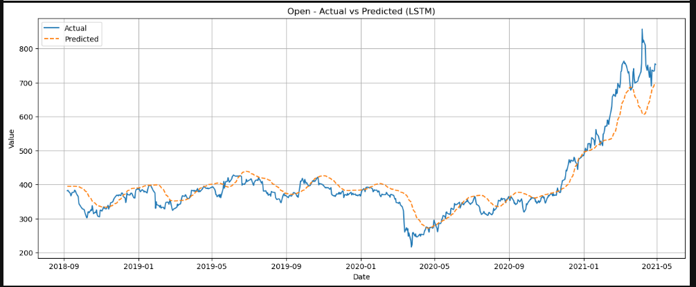<br>
   Image 1.1 - LSTM Data prediction Result - Open
   
   <br>
   Image 1.2 - LSTM Data prediction Result - High
   
   <br>
   Image 1.3 - LSTM Data prediction Result - Low
   
   <br>
   Image 1.4 - LSTM Data prediction Result - Prev Close
   
   <br>
   Image 1.5 - LSTM Data prediction Result - Close
   
   <br>
   Image 1.6 - LSTM Data prediction Result - VWAP
   
   ****Description:****
   - This diagram compares the actual and predicted values of the stock prices using an LSTM model
   - The blue line represents actual prices, while the orange dashed line shows the model's predictions
   - The chart shows that the predicted line mirrors the general trend of the actual prices — rising and falling in roughly the same places (which suggests the model effectively learns directional movement)
   - However, there's visible divergence in timing and amplitude:
      - The model sometimes lags behind sudden shifts
      - The predicted line doesn’t fully replicate sharp peaks and drops in the actual values
   - This mismatch could be due to a few factors:
      - LSTM’s memory limitations in capturing sudden volatility
      - Lack of external features (like macroeconomic signals or news sentiment) to explain abrupt changes (Or just the inherent unpredictability of stock prices that can't be learned from past prices alone)
   </details>
   
<details>
   <summary>Result of stock data prediction (LSTM) - Stock Volume Data</summary>
   <br>
   Image 1.7 - LSTM Data prediction Result - Volume
   
   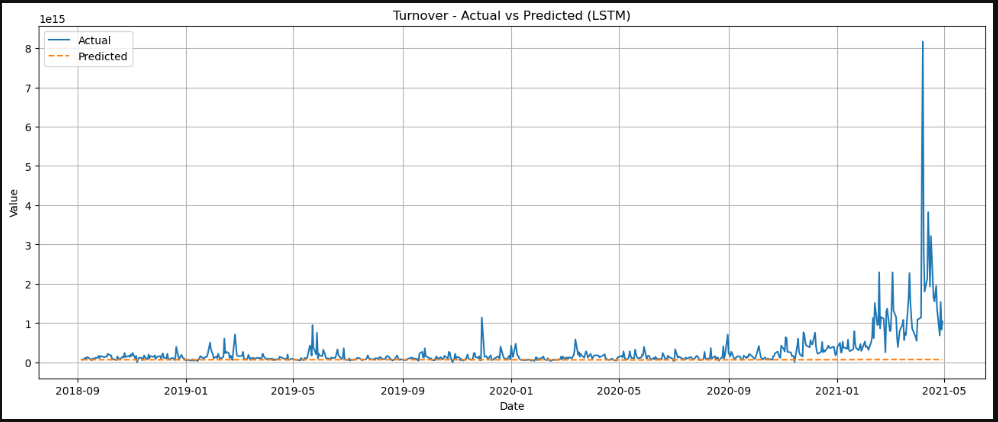<br>
   Image 1.8 - LSTM Data prediction Result - Turnover
   
   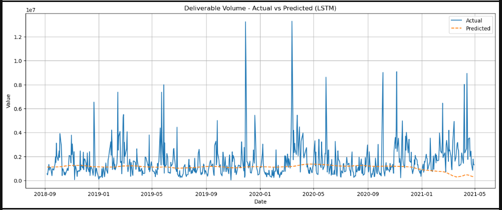<br>
   Image 1.9 - LSTM Data prediction Result - Deliverable Volume
   
   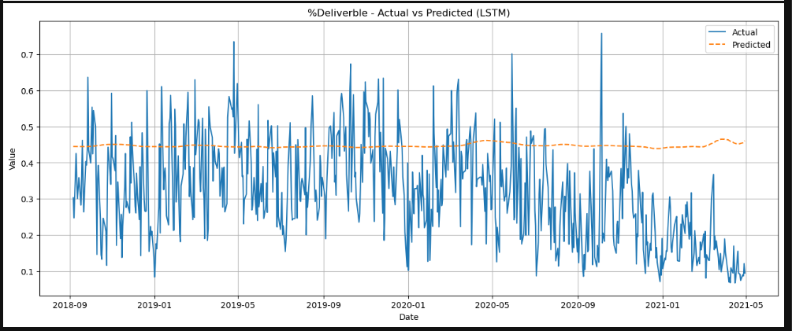<br>
   Image 1.10 - LSTM Data prediction Result - %Deliverable
   
   ****Description:**** <br>
   - While the LSTM model successfully captures the underlying baseline of volume-related data, it lacks sensitivity to sudden surges or dips (This shortcoming is likely becausee is often driven by short-term catalysts, such as company news, earnings releases, or macroeconomic shocks — none of which are encoded in historical OHLCV data alone)
   - Consequently, the model’s predictions appear muted during periods of heightened activity, underscoring the need for exogenous features or alternative architectures to reflect the dynamic nature of trading volume better
</details>

### 2. Prediction Results For RNN
<details>
   <summary>Result of stock data prediction (RNN) - Stock Price Data</summary>
   <br>
   Image 2.1 - RNN Data prediction Result - Open
   
   <br>
   Image 2.2 - RNN Data prediction Result - High
   
   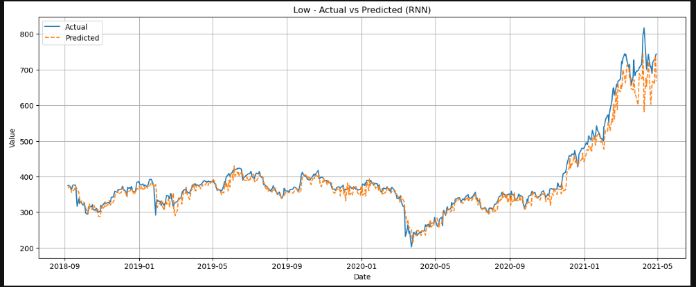<br>
   Image 2.3 - RNN Data prediction Result - Low
   
   <br>
   Image 2.4 - RNN Data prediction Result - Prev Close
   
   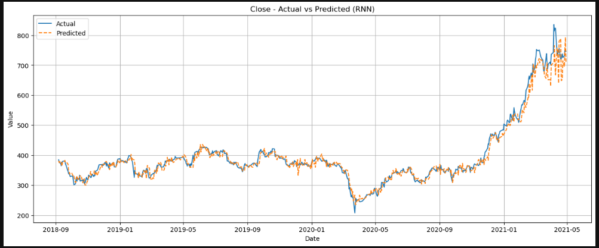<br>
   Image 2.5 - RNN Data prediction Result - Close
   
   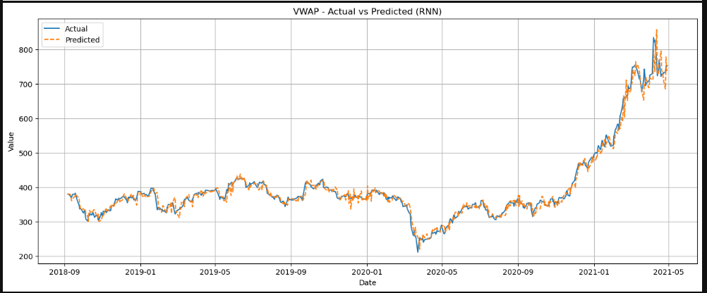<br>
   Image 2.6 - RNN Data prediction Result - VWAP
   
   ****Description:****
   - The overall trend between both lines aligns closely, especially during gradual movements, demonstrating the model’s ability to capture the directional flow of the data
   - However, minor mismatches appear during sharp spikes or dips — a reflection of the model forecasting based only on historical values, without external signals
</details>

<details>
   <summary>Result of stock data prediction (RNN) - Stock Volume Data</summary>
   <br>
   Image 2.7 - RNN Data prediction Result - Volume
   
   <br>
   Image 2.8 - RNN Data prediction Result - Turnover
   
   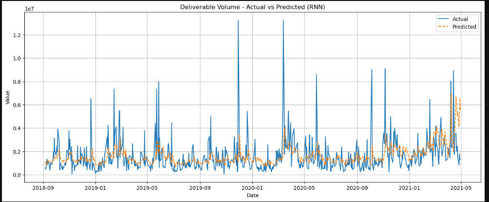<br>
   Image 2.9 - RNN Data prediction Result - Deliverable Volume
   
   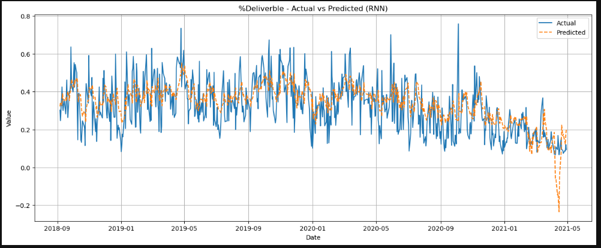<br>
   Image 2.10 - RNN Data prediction Result - %Deliverable
   
   ****Description:**** <br>
   For others:
   - It underreacts to significant fluctuations, missing key surges in trading volume (While the RNN captures the broad structure of turnover trends)
   - This gap highlights a limitation of using recursive RNN predictions on high-volatility financial features — the model doesn't integrate sudden market catalysts like earnings surprises or macroeconomic shifts
   
   For %Deliverable Data:
   - The prediction curve stays relatively close to the average trend of the actual data, showing that the model captures broad directional movement
   - However, significant variance exists during abrupt fluctuations — the model fails to replicate sharp spikes or sudden drops
</details>

### 3. Prediction Results For CNN
<details>
   <summary>Result of stock data prediction (CNN) - Stock Price Data</summary>
   <br>
   Image 3.1 - CNN Data prediction Result - Open
   
   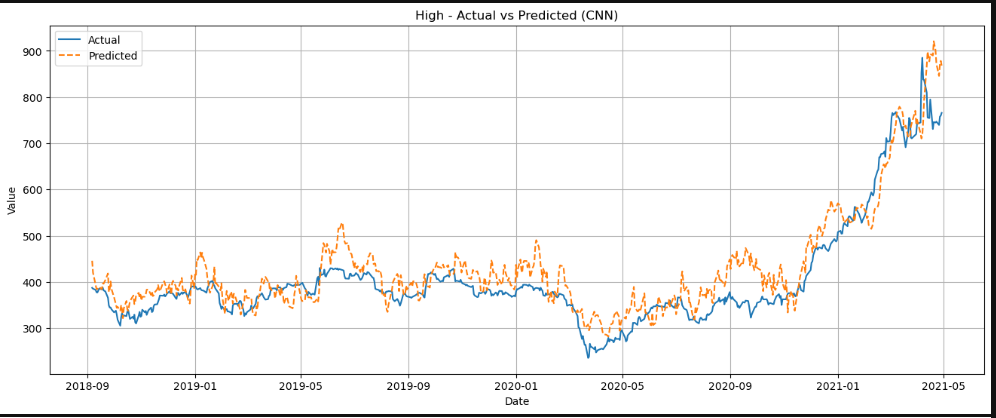<br>
   Image 3.2 - CNN Data prediction Result - High
   
   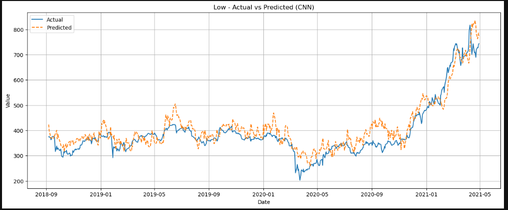<br>
   Image 3.3 - RNN Data prediction Result - Low
   
   <br>
   Image 3.4 - CNN Data prediction Result - Prev Close
   
   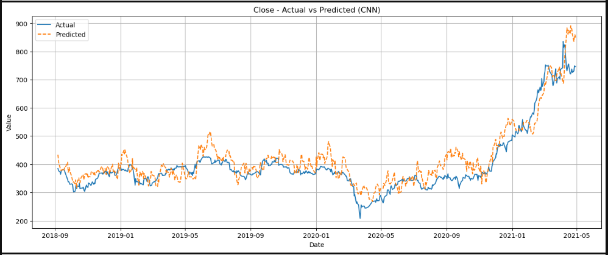<br>
   Image 3.5 - CNN Data prediction Result - Close
   
   <br>
   Image 3.6 - CNN Data prediction Result - VWAP
   
   ****Description:****
   - The model successfully learns and tracks the overall price trend — particularly during steady climbs and dips
   - However, it occasionally lags behind major price shifts (Failing to fully capture the amplitude of sharp market movements)
   - This pattern reveals CNN’s strength in recognizing patterns from local data windows (But also its limits in modeling long-term temporal dependencies — a known constraint when predicting volatile time series like stock prices)
</details>

<details>
   <summary>Result of stock data prediction (CNN) - Stock Volume Data</summary>
   <br>
   Image 3.7 - CNN Data prediction Result - Volume
   
   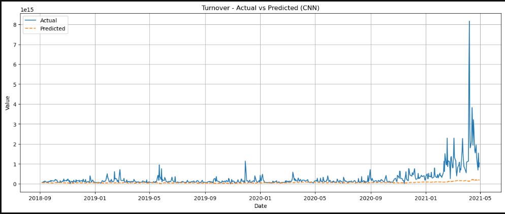<br>
   Image 3.8 - CNN Data prediction Result - Turnover
   
   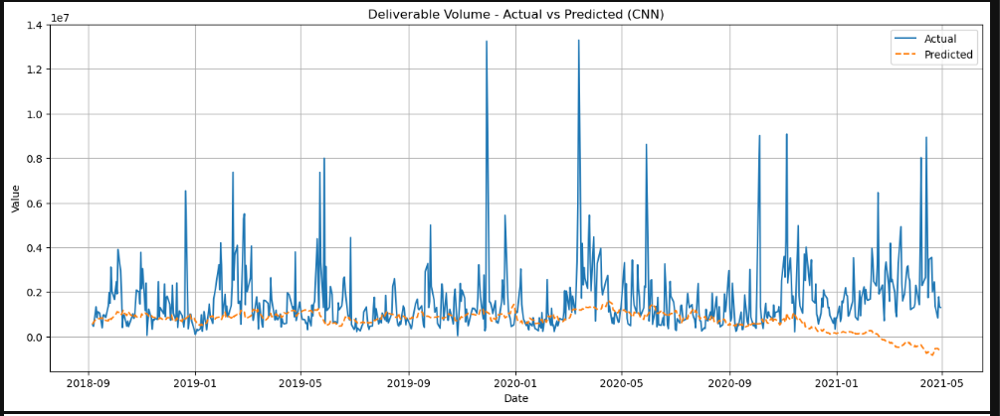<br>
   Image 3.9 - CNN Data prediction Result - Deliverable Volume
   
   <br>
   Image 3.10 - CNN Data prediction Result - %Deliverable
   
   ****Description:****
   For others:
   - The CNN model maintains a mostly flat prediction line (It significantly underestimating the actual turnover dynamics)
   - Meanwhile, the real data shows prominent spikes and shifts—especially around early 2021 — indicating periods of intense trading activity that the model fails to reflect
   - This visual highlights CNN’s difficulty with capturing large-scale fluctuations in turnover (Due to its limited temporal awareness and lack of external contextual features like earnings events, investor sentiment, or economic indicators)
   
   For %Deliverable:
   - The CNN model captures the general baseline trend, aligning with the average level of deliverability during stable periods.
   - However, it underperforms during volatile changes (Especially failing to reproduce sharp spikes or rapid drops in real data)
   - This highlights CNN’s limitation in forecasting noisy time series with high-frequency variation (While it detects patterns within short windows, it struggles to track abrupt deviations unless supplemented with external features)
</details>

#### 4. Forecast Data Comparison<br>
To evaluate the performance and reliability of the predictive models, I would compared their outputs against actual observed values using the Mean Absolute Error (MAE) as the primary metric:
- MAE provides an intuitive measure of prediction accuracy by quantifying the average deviation between estimated and true values
- A lower MAE indicates greater precision in the model’s forecasts, making it a valuable benchmark for comparison across different approaches and datasets

### Prediction Results Comparsion
<details>
   <summary>Source Code for Data Comparsion</summary>
   <br>
   Image 4.1 - Source Code for data comparison

   ****Description:****<br>
   To identify the most accurate prediction model across multiple architectures (e.g. CNN, RNN, LSTM), the following steps are used:
   1. Data Preparation<br>
   - For each target column (e.g. volume, close price), extract the ground truth series from the “Actual” dataset.
   
   2. Iterative Model Evaluation<br>
   - Loop through each model's prediction dataset
   - Skip the “Actual” entry to avoid self-comparison
   - Align the predicted series with the actual one using inner joins to ensure proper index matching

   3. Error Calculation<br>
   - Compute Mean Absolute Error (MAE) between the aligned predicted and actual series
   - Store each model’s MAE score for the current column
     
   4. Best Model Selection<br>
   - Choose the model with the lowest MAE score—this indicates the most accurate predictions for that column
     
   5. Visualization<br>
   - Plot time series data for the actual values and each model’s predictions
   - Highlight the best-performing model for visual comparison
</details>

<details>
   <summary>Image for Data Comparison</summary>
   <details>
   <summary>Data Comparison (Stock Price Data)</summary>
   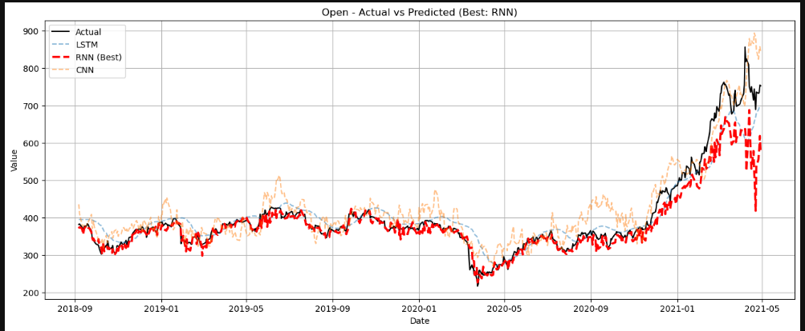<br>
   Image 4.2 - Data Comparison Result - Open
      
   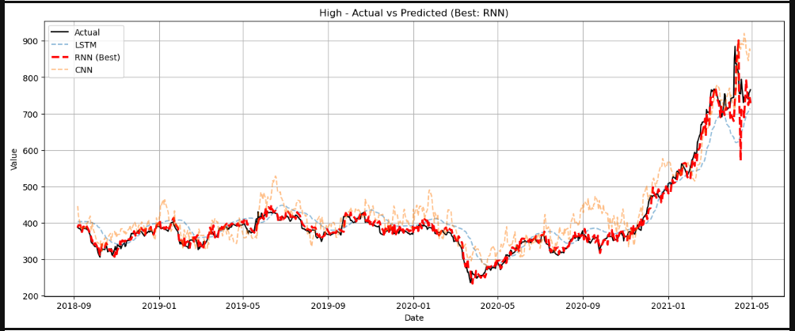<br>
   Image 4.3 - Data Comparison Result - High
      
   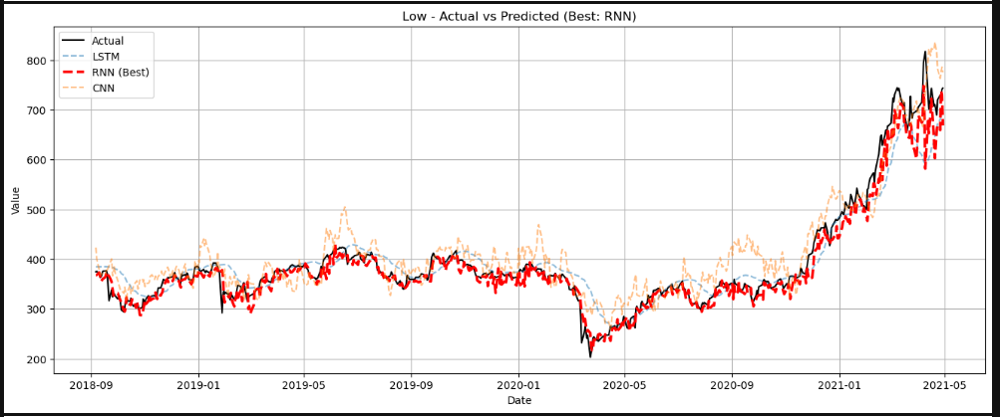<br>
   Image 4.4 - Data Comparison Result - Low
      
   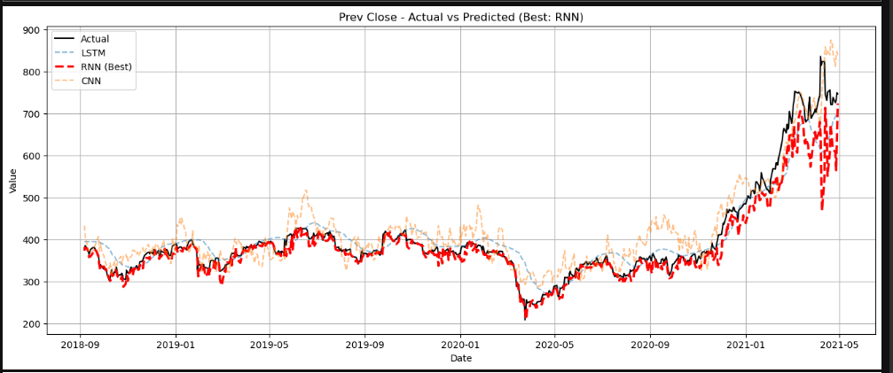<br>
   Image 4.5 - Data Comparison Result - Prev Close
      
   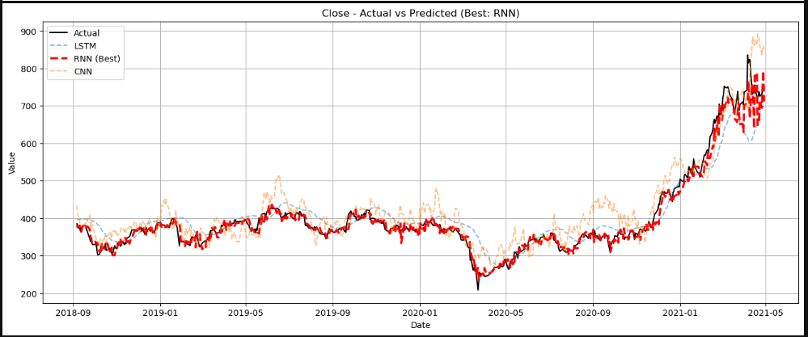<br>
   Image 4.6 - Data Comparison Result - Close
      
   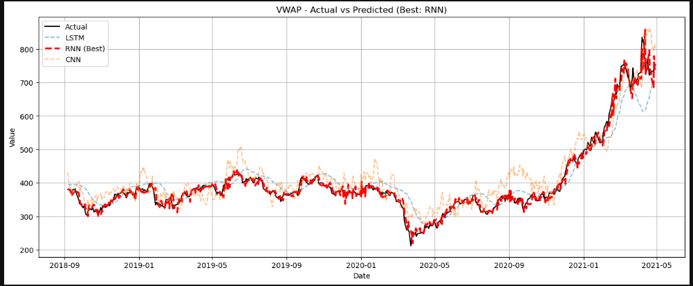<br>
   Image 4.7 - Data Comparison Result - VWAP<br>
   
   ****Description:****<br>
   - The RNN model shows strong predictive performance across six stock price attributes: Prev Close, Open, High, Low, Close, and VWAP
      - For each metric, the forecast curve closely aligns with actual values, maintaining smooth temporal behaviour with minimal lag or noise
      - The consistent prediction quality across all diagrams emphasizes the model's capacity to learn and replicate market price dynamics (Even during volatile periods)
   - The uniformity in results reinforces the RNN’s dependability for price-based forecasting tasks

   ****Conclusion:****<br>
   - The model provides consistently accurate forecasts across all price metrics, showcasing the robustness of the RNN approach
   - It also demonstrates its value as a comprehensive forecasting tool for both liquidity and price movements in financial markets when combined with strong performance in volume-related indicators
   </details>

   <details>
   <summary>Data Comparison (Stock Volume Data)</summary>
   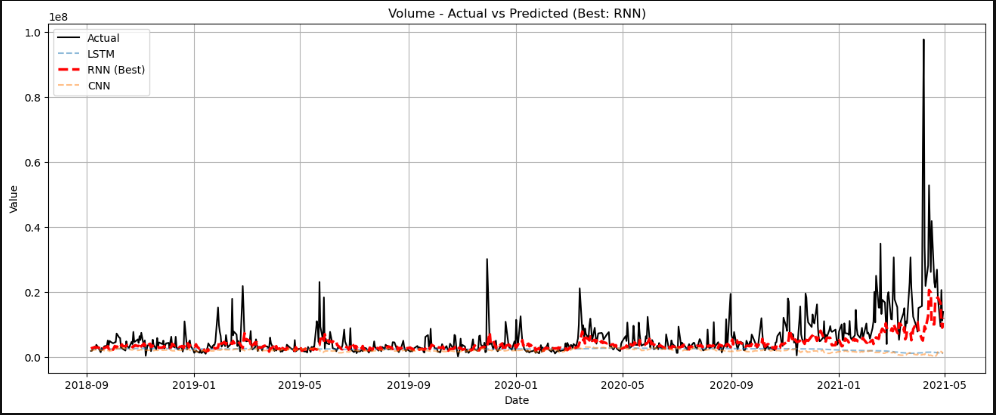<br>
   Image 4.8 - Data Comparison Result - Volume
   
   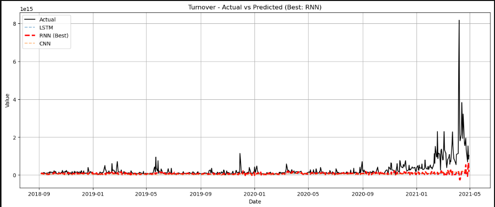<br>
   Image 4.9 - Data Comparison Result - Turnover
   
   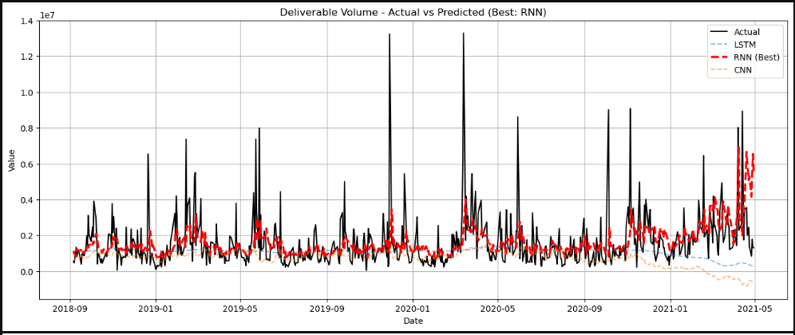<br>
   Image 4.10 - Data Comparison Result - Deliverable Volume
   
   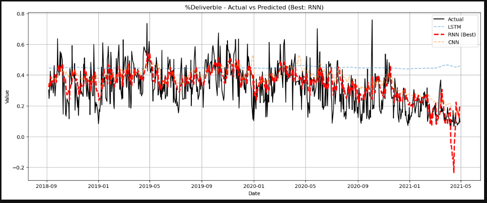<br>
   Image 4.11 - Data Comparison Result - %Deliverable<br>

   ****Description:****<br>
   - Volume – Actual vs Prediction (Best: RNN)
      - The RNN effectively tracks trading volume patterns, showing strong alignment with recent fluctuations
      - Any divergences highlight where market behaviour deviated from historical trends captured by the model

   - Turnover – Actual vs Prediction (Best: RNN)
      - The predicted turnover closely mirrors actual performance, indicating the model's sensitivity to high-value transactions
      - Useful for understanding cash flow intensity on trading days

   - Deliverable Volume – Actual vs Prediction (Best: RNN)
      - The model excels in identifying deliverable activity, which may reflect investor confidence or long-term interest
      - Minor prediction errors here could relate to sudden shifts in speculative trading

   - %Deliverable – Actual vs Prediction (Best: RNN)
      - This metric is more stable and reflects underlying market sentiment
      - The model’s prediction maintains a consistent trend, confirming its reliability in forecasting investor behaviour
    
   ****Conclusion:****<br>
   - Overall, the RNN model demonstrates high accuracy across all volume-related metrics, making it a strong candidate for anticipating future trading behaviour
   </details>

   ****Summary:****<br>
   - The RNN model consistently shows high predictive accuracy across price- and volume-related stock attributes. Whether forecasting daily price movements—such as Open, Close, High, Low, VWAP, and Prev Close — or analysing market activity via Volume, Turnover, Deliverable Volume, and %Deliverable, the model demonstrates:
      - Tight alignment with actual market trends
      - Minimal prediction lag or volatility
      - Strong responsiveness to fluctuating behaviour
      - Reliability in tracking investor sentiment and liquidity
   - This cross-dimensional consistency reinforces the robustness of the RNN approach in capturing time-series stock behaviour
   - The model is well-suited for building intelligent forecasting systems that anticipate both market price action and transactional dynamics.
</details>

## License
MIT License

Copyright (c) 2025 TomWai821

Permission is hereby granted, free of charge, to any person obtaining a copy
of this software and associated documentation files (the "Software"), to deal
in the Software without restriction, including without limitation the rights
to use, copy, modify, merge, publish, distribute, sublicense, and/or sell
copies of the Software, and to permit persons to whom the Software is
furnished to do so, subject to the following conditions:

The above copyright notice and this permission notice shall be included in all
copies or substantial portions of the Software.

THE SOFTWARE IS PROVIDED "AS IS", WITHOUT WARRANTY OF ANY KIND, EXPRESS OR
IMPLIED, INCLUDING BUT NOT LIMITED TO THE WARRANTIES OF MERCHANTABILITY,
FITNESS FOR A PARTICULAR PURPOSE AND NONINFRINGEMENT. IN NO EVENT SHALL THE
AUTHORS OR COPYRIGHT HOLDERS BE LIABLE FOR ANY CLAIM, DAMAGES OR OTHER
LIABILITY, WHETHER IN AN ACTION OF CONTRACT, TORT OR OTHERWISE, ARISING FROM,
OUT OF OR IN CONNECTION WITH THE SOFTWARE OR THE USE OR OTHER DEALINGS IN THE
SOFTWARE.
